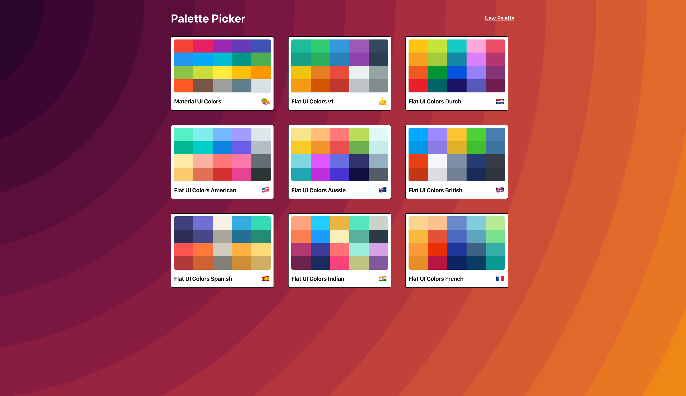
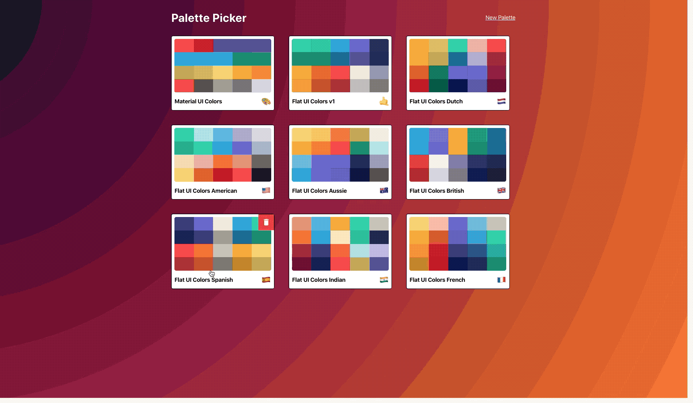
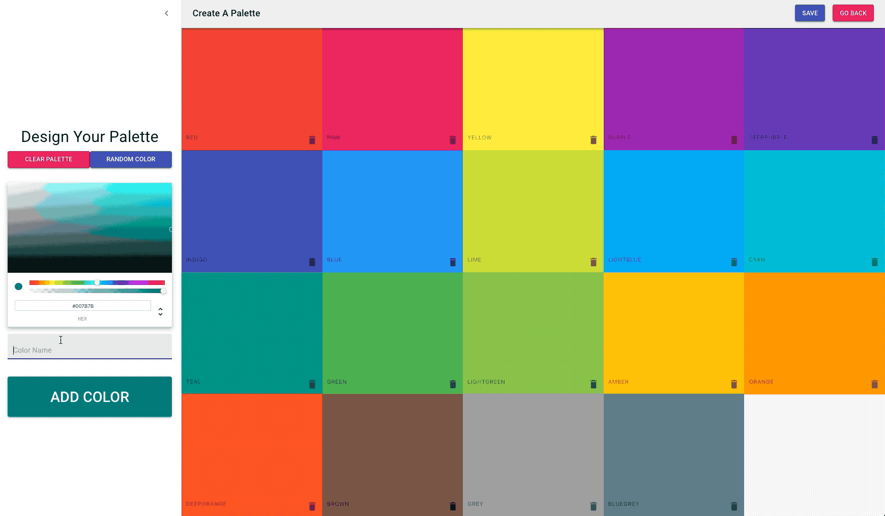
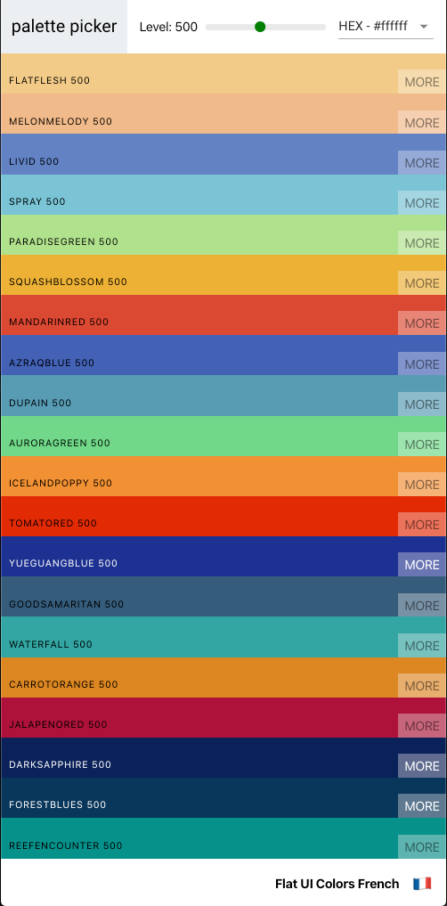

# Palette Picker

* A combination of [Flat UI Colors](https://flatuicolors.com/) and [Material UI Colors](http://materialuicolors.co/?utm_source=launchers) tools.
* This site allows users to create and save color palettes for use in web development.
* I completed this project as part of The Modern React Bootcamp by Colt Steele, and added my own touches to it.

## Palettes let you save colors in any format, and view all hues of the color.

## Create and rearrange your own colours, or use random ones!

## The app is responsive, and can be used comfortably on any device.

