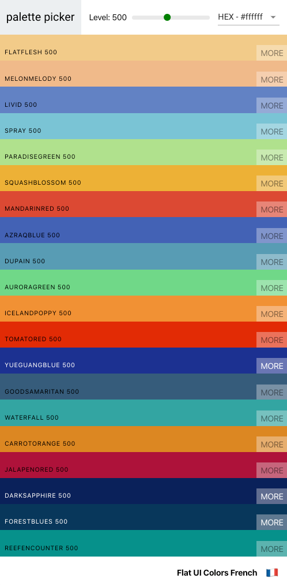

# Palette Picker

- A combination of [Flat UI Colors](https://flatuicolors.com/) and [Material UI Colors](http://materialuicolors.co/?utm_source=launchers) tools.
- This site allows users to create and save color palettes for use in web development.
- Check it out at https://antonaroche.github.io/palette-picker !

## Palettes let you save colors in any format, and view all shades of the color.

## Create and rearrange your own colours, or use random ones!

## The app is responsive, and can be used comfortably on any device.

